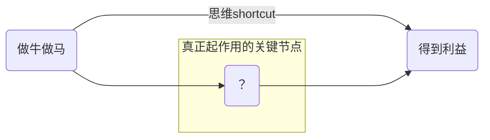
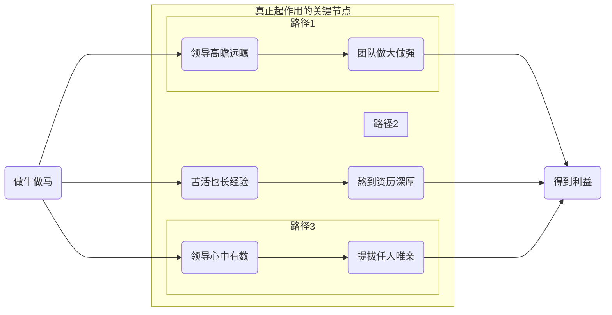

## shortcut

```mermaid
graph LR
subgraph 真正起作用的关键节点
2(？)
end
1(做牛做马)
3(得到利益)
1--思维shortcut-->3
1---->2
2---->3
```

## whole picture

```mermaid
graph LR
subgraph 真正起作用的关键节点
subgraph 路径3
6(领导心中有数)
7(提拔任人唯亲)
end
4(苦活也长经验)
5(熬到资历深厚)
6(领导心中有数)
7(提拔任人唯亲)
end
subgraph 真正起作用的关键节点
subgraph 路径2
4(苦活也长经验)
5(熬到资历深厚)
end
4(苦活也长经验)
5(熬到资历深厚)
6(领导心中有数)
7(提拔任人唯亲)
end
subgraph 真正起作用的关键节点
subgraph 路径1
2(领导高瞻远瞩)
3(团队做大做强)
end
4(苦活也长经验)
5(熬到资历深厚)
6(领导心中有数)
7(提拔任人唯亲)
end
1(做牛做马)
8(得到利益)
1---->2
2---->3
1---->4
4---->5
1---->6
6---->7
3---->8
5---->8
7---->8
```
