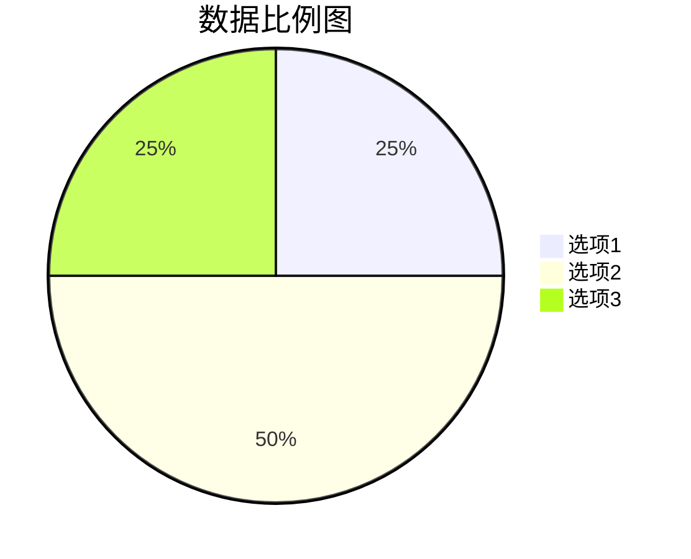
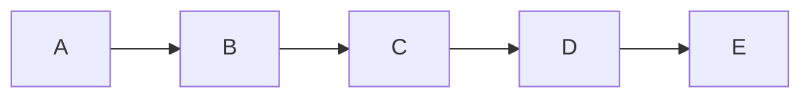
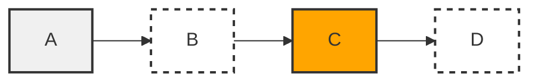
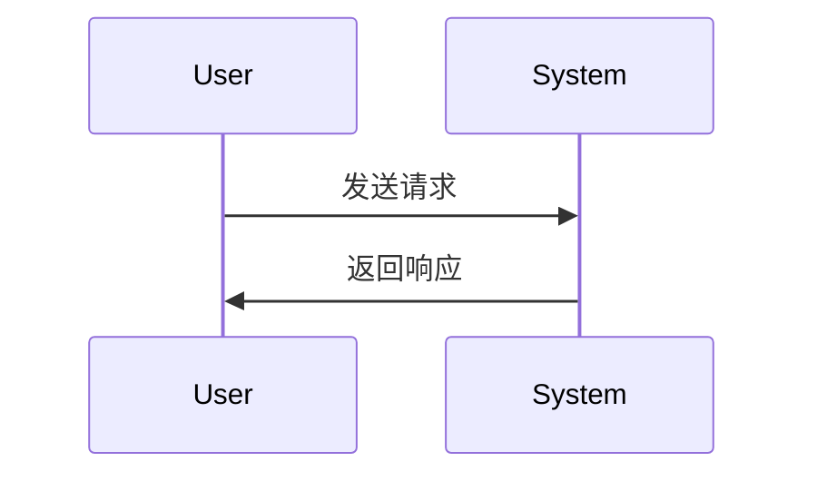
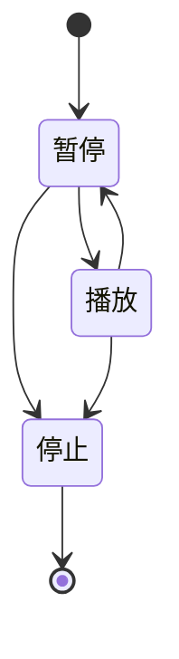
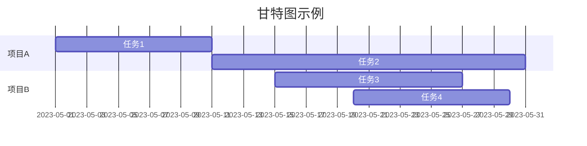
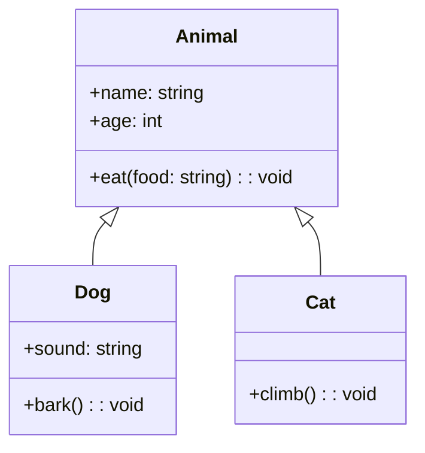
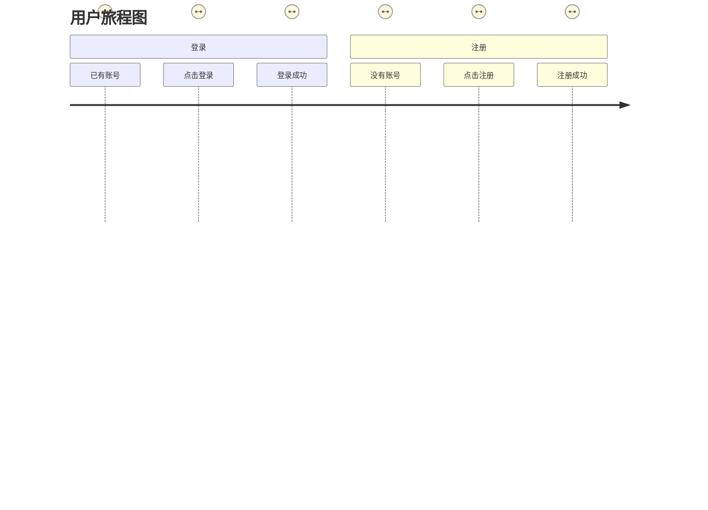

图表类型支持
饼形图(Pie Chart)
流程图(Flow Chart)
时序图(Sequence Diagram)
状态图(State Diagram)
甘特图(Gantt Diagram)
类图(class Diagram)
用户旅程图

- 饼图
  
Pie Chart,中文也称之为“饼状图”,是一种常用的数据可视化工具,可以用于展示不同部分之间的占比关系。使用Mermaid 绘制饼形图也十分简单,只需要按照以下格式编写即可:

其中,title是饼形图的标题,选项1/2/3是各个数据选项的名称,25/50/25则是它们对应的数值。你可以根据需要自行修改数据选项的个数以及对应的数值。

除此之外,还有一些可选的参数可以进行设置:

colors:用于设置各个数据选项对应的颜色。默认情况下,Mermaid会自动为每个数据选项分配一种颜色,也可以手动指定颜色;
labelFormat:用于设置饼形图上的数据标签格式,可以是数字、百分比等。
labelPosition:用于设置数据标签的位置,可以是饼形图内部、外部或者中心位置。
在绘制完饼形图之后,你可以将它嵌入到你的文章或者报告中,这样就能够清晰直观地展示数据的占比关系了。

- 流程图
  
除了饼形图之外,Mermaid还支持多种图表类型,其中最常用的就是流程图了。

流程图可以用于展示某个过程中各个步骤的顺序和关系,例如软件开发过程中的各个阶段、某个业务流程中的各个环节等等。

使用Mermaid绘制流程图同样也是非常简单的:

其中,每个人物或状态都用一个大写字母表示。箭头表示流程中的方向,可以是两个人物之间直接的连线,也可以是虚拟的线。

例如,上面的流程图中,大写字母A表示流程的初始状态,箭头指向B表示从状态A到状态B的流程方向。

节点还可以调用修饰函数,对节点进行颜色、边框、虚线等方面的设置,如下所示:

其中,style关键词用于调用修饰函数,上面的代码中,我们对节点A、B、C、D进行了不同的设置,使它们具有不同的颜色和边框样式。

时序图
时序图可以用于展示系统交互、程序控制流程等。在 Mermaid 中,时序图的渲染方式也是非常简便的。

- 状态图

状态图用于展示对象的状态和状态间的转移过程。在mermaid中,状态图的语法也是非常简单的。状态图可以用于展示对象的生命周期、状态转移等。

- 甘特图

甘特图用于展示项目进度安排、任务分配等信息,也是mermaid支持的一种图表类型。

甘特图也支持更多的属性设定,如颜色、进度等,可以参考官方文档进行进一步学习。

- 类图

类图用于展示类之间的关系,属性和方法。在mermaid中,类图的语法也是非常常用的。

class类图中还有更多的属性设定,如抽象类、接口、关联关系等,可以参考官方文档进行更多学习。

- 用户旅程

用户旅程图主要分为多个阶段或步骤,描述了用户在使用产品或服务时的流程和情感反应。

在每个步骤中,可以进一步描述用户的行为和反馈,可以帮助产品团队更好地理解用户需求和体验,进而进行产品优化和改进。

在mermaid中,用户旅程图的语法如下:

