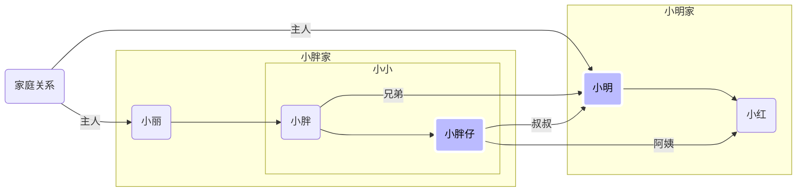

```mermaid
graph LR
subgraph 小胖家
subgraph 小小
5(小胖)
6(小胖仔)
end
2(小丽)
end
subgraph 小明家
3(小明)
4(小红)
end
1(家庭关系)
1--主人-->2
1--主人-->3
3---->4
2---->5
5--兄弟-->3
5---->6
6--叔叔-->3
6--阿姨-->4
style 3 fill:#bbf,stroke:#fff,color:#000,stroke-width:4px
style 6 fill:#bbf,stroke:#fff,color:#000,stroke-width:4px
```
